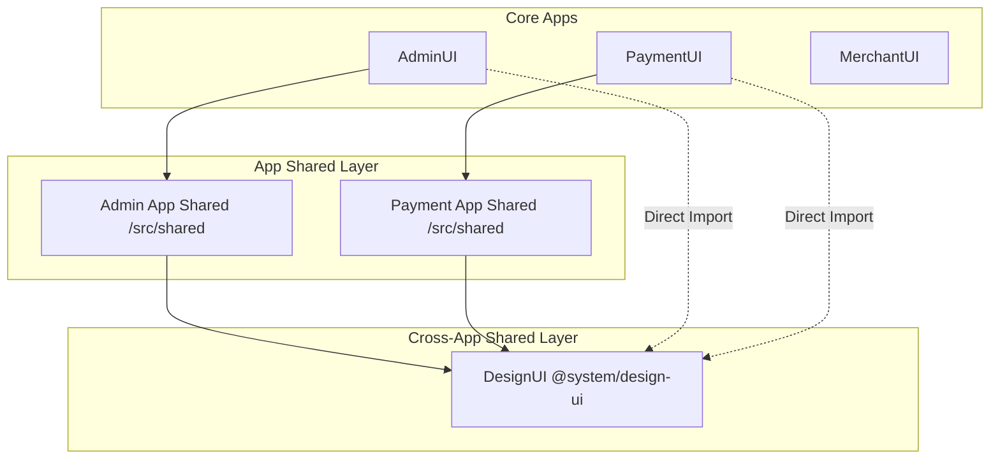

# Kiến Trúc Frontend và Quy Ước Thiết Kế Hệ Thống (Frontend Architecture & Design Conventions)

Tài liệu này định nghĩa chi tiết kiến trúc frontend được áp dụng cho toàn bộ các ứng dụng trong hệ sinh thái (bao gồm `AdminUI`, `PaymentUI`, `MerchantUI`, và `PortalUI`). Kiến trúc này được thiết kế theo mô hình **Domain-Driven Feature-Sliced (Kiến trúc phân lát theo miền tính năng)** kết hợp với **Monorepo Shared Design System** nhằm phục vụ khả năng mở rộng (scalability), dễ bảo trì (maintainability), và phân tách trách nhiệm rõ ràng (decoupling).

---

## 1. Triết Lý Thiết Kế (Design Philosophy)

Để tránh hiện tượng ứng dụng frontend bị phình to nguyên khối (monolithic chaos) hoặc rơi vào trạng thái "nhét tất cả vào một file screen", hệ thống tuân thủ 3 triết lý chính:
1. **Phân tách trách nhiệm triệt để (Separation of Concerns - SoC)**: Phân tách rõ ràng giữa lớp vận chuyển dữ liệu (API), lớp quản lý trạng thái nghiệp vụ (Custom Hooks), lớp trình diễn bố cục (Screens), và các khối giao diện nền tảng (Stateless Components).
2. **Ngăn ngừa rò rỉ mã nguồn (Encapsulation)**: Mỗi miền tính năng (feature domain) tự đóng gói toàn bộ logic của nó. Các phần tử bên ngoài chỉ giao tiếp với miền thông qua giao diện công khai (Public Interface/Barrel export).
3. **Thăng hạng linh hoạt (Component Promotion)**: Linh kiện giao diện đi từ cục bộ (Feature-Local) -> dùng chung nội bộ app (App-Shared) -> dùng chung toàn hệ thống (Monorepo-Shared Design System) dựa trên bằng chứng tái sử dụng thực tế.

---

## 2. Mô Hình Phân Lớp 3 Tầng (3-Tier Monorepo Model)



### Lớp 1: Cross-App Shared (Dùng chung toàn hệ thống)
*   **Vị trí**: `DesignUI` (Package cục bộ `@system/design-ui`).
*   **Trách nhiệm**:
    *   Các biến phong cách, Tokens màu sắc hệ thống (CSS Variables, Tailwind Tokens).
    *   Linh kiện giao diện gốc (Atomic Components) không chứa logic nghiệp vụ backend: `Button`, `Input`, `Table`, `Badge`, `Card`, `FilterBar`, `EmptyStatePanel`.
*   **Quy tắc**: Không chứa bất kỳ API call hay giả định nghiệp vụ nào liên quan đến backend.

### Lớp 2: App Shared (Dùng chung trong một App)
*   **Vị trí**: `src/shared/` hoặc `src/components/ui/` của từng ứng dụng.
*   **Trách nhiệm**:
    *   Các linh kiện bố cục chính (Layout Shell, Sidebar, Navigation).
    *   Các wrapper tùy chỉnh cấu hình riêng cho ứng dụng đó.
*   **Quy tắc**: Chỉ dùng chung giữa các màn hình *trong cùng một ứng dụng*. Nếu một component lớp này bắt đầu được copy sang ứng dụng thứ hai, nó phải được tổng quát hóa và chuyển xuống Lớp 1 (`DesignUI`).

### Lớp 3: Feature Local (Đóng gói theo tính năng)
*   **Vị trí**: `src/features/[feature-name]/`
*   **Trách nhiệm**:
    *   Toàn bộ luồng nghiệp vụ, API, Hook, Screen của một tính năng cụ thể.
*   **Quy tắc**: Đây là nơi chứa hầu hết các mã nguồn xử lý logic thực tế của dự án.

---

## 3. Cấu Trúc Chi Tiết Bên Trong Một App (Vite vs Next.js)

Dưới đây là sơ đồ so sánh trực quan cấu trúc thư mục giữa dự án SPA (Vite) và dự án Hybrid (Next.js) áp dụng chung một kiến trúc nghiệp vụ:

### 3.1 Bảng so sánh Cấu trúc Thư mục

| Thư mục / File | ⚛️ Vite App Router (SPA) | ⚡ Next.js (App Router) | Vai trò |
| :--- | :--- | :--- | :--- |
| **Định tuyến (Routing)** | `src/core/routes.tsx` | Thư mục `app/` (`layout.tsx`, `page.tsx`) | Lớp vỏ định tuyến của Framework |
| **Điểm cấu hình (Core)** | `src/core/` (query-client, auth) | Thư mục `app/` hoặc `src/core/` | Khởi tạo cấu hình hạ tầng |
| **Mã nguồn nghiệp vụ** | `src/features/` | `src/features/` (hoặc `features/`) | **Giống nhau 100%** (Nghiệp vụ thuần) |
| **Dùng chung nội bộ** | `src/shared/` | `src/shared/` | Component, hooks dùng chung của App |

### 3.2 Cấu trúc thư mục chi tiết

```yaml
# KIẾN TRÚC VITE (React SPA)                 # KIẾN TRÚC NEXT.JS (App Router)
src/                                         src/ (hoặc root)
├── main.tsx                                 ├── app/                       # Thư mục routing của Next.js
├── App.tsx                                  │   ├── layout.tsx             # Root layout của Next.js
├── index.css                                │   ├── page.tsx               # Trang chủ
├── core/                                    │   └── checkout/              # Route /checkout
│   ├── api-client.ts                        │       └── page.tsx           # Render <CheckoutScreen /> từ features
│   └── routes.tsx     # Route Table         ├── core/                      # Cấu hình API, Auth
├── shared/            # App Shared          │   ├── api-client.ts          
│   └── components/                          │   └── query-client.ts
└── features/          # NGHIỆP VỤ MIỀN      ├── shared/                    # App Shared
    └── checkout/                            └── features/                  # NGHIỆP VỤ MIỀN (GIỐNG HỆT VITE)
        ├── api/       # API endpoints           └── checkout/
        ├── hooks/     # Custom hooks                ├── api/
        ├── screens/   # Screen views                ├── hooks/
        └── index.ts   # Public API                  ├── screens/
                                                     └── index.ts
```

---

## 4. Chi Tiết Các Thành Phần Nghiệp Vụ (Feature Sub-folders)

### 4.1 Lớp API (`features/[feature]/api/`)
*   **Mục đích**: Chỉ chứa khai báo kiểu dữ liệu (TypeScript Interfaces) và các hàm gọi API HTTP bằng Axios/Fetch.
*   **Quy tắc**:
    *   Tên file nên kết thúc bằng `Api.ts` (ví dụ: `transactionsApi.ts`).
    *   Không khai báo bất kỳ React Hook hay State nào trong thư mục này.
    *   Nên export rõ ràng kiểu Request và Response.

```typescript
// Ví dụ: features/checkout/api/checkoutApi.ts
import { apiClient } from '../../../core/api-client';

export interface PaymentTransaction {
  paymentId: string;
  amount: number;
  status: 'pending' | 'paid' | 'cancelled';
  createdAt: string;
}

export interface PagedResult<T> {
  items: T[];
  totalCount: number;
}

export async function getTransactions(page: number, pageSize: number): Promise<PagedResult<PaymentTransaction>> {
  const response = await apiClient.get<PagedResult<PaymentTransaction>>('/api/payments/me/transactions', {
    params: { page, pageSize }
  });
  return response.data;
}
```

### 4.2 Lớp Custom Hooks (`features/[feature]/hooks/`)
*   **Mục đích**: Đóng gói toàn bộ React Query queries/mutations và logic nghiệp vụ, lọc dữ liệu cục bộ, hoặc tính toán logic liên quan.
*   **Quy tắc**:
    *   Tên hook bắt đầu bằng `use`.
    *   Đảm bảo tách biệt logic UI khỏi screen. Screen chỉ gọi hook này để lấy data, loading state, và handler functions.

```typescript
// Ví dụ: features/checkout/hooks/useFilteredTransactions.ts
import { useState } from 'react';
import { useQuery } from '@tanstack/react-query';
import { getTransactions } from '../api/checkoutApi';

export function useFilteredTransactions(page = 1, pageSize = 5) {
  const [searchQuery, setSearchQuery] = useState('');
  const [category, setCategory] = useState('Tất cả');

  const { data, isLoading, refetch, isFetching } = useQuery({
    queryKey: ['transactions', page, pageSize],
    queryFn: () => getTransactions(page, pageSize),
  });

  const transactions = data?.items || [];
  
  const filtered = transactions.filter((t) => {
    // Logic lọc cục bộ (client-side)
    const matchesSearch = searchQuery ? t.paymentId.includes(searchQuery) : true;
    const matchesCategory = category !== 'Tất cả' ? t.status === category : true;
    return matchesSearch && matchesCategory;
  });

  return {
    transactions: filtered,
    rawTransactions: transactions,
    isLoading,
    isFetching,
    refetch,
    searchQuery,
    setSearchQuery,
    category,
    setCategory,
    totalCount: data?.totalCount || 0
  };
}
```

### 4.3 Lớp Screens (`features/[feature]/screens/`)
*   **Mục đích**: Điểm kết nối (Aggregator) của Route. Nó kết nối dữ liệu từ Custom Hook với các Component trình diễn để render ra màn hình hoàn chỉnh.
*   **Quy tắc**:
    *   Không trực tiếp khai báo các hàm gọi API axios/fetch.
    *   Tránh viết các cụm JSX giao diện con phức tạp (như form nhập thẻ, modal xác nhận) trực tiếp trong file này nếu file vượt quá 400 dòng.
    *   Chủ yếu đóng vai trò cấu trúc bố cục (Layout Composition).

```tsx
// Ví dụ: features/checkout/screens/CheckoutScreen.tsx
import React, { useState } from 'react';
import { useFilteredTransactions } from '../hooks/useFilteredTransactions';
import { Table, FilterBar, Card, Spinner } from '@system/design-ui';
import { OrderSummary } from '../components/OrderSummary';

export const CheckoutScreen: React.FC = () => {
  const [page, setPage] = useState(1);
  const {
    transactions,
    isLoading,
    searchQuery,
    setSearchQuery,
    category,
    setCategory
  } = useFilteredTransactions(page, 5);

  if (isLoading) return <Spinner />;

  return (
    <div className="flex gap-6">
      <div className="flex-1 space-y-4">
        <FilterBar
          searchQuery={searchQuery}
          setSearchQuery={setSearchQuery}
          activeCategory={category}
          setActiveCategory={setCategory}
          categories={['pending', 'paid', 'cancelled']}
        />
        <Card>
          <Table data={transactions} />
        </Card>
      </div>
      <OrderSummary />
    </div>
  );
};
```

### 4.4 Cổng Giao Tiếp Công Khai (`features/[feature]/index.ts` - Barrel Export)
*   **Mục đích**: Đóng vai trò là "bức tường lửa" (Encapsulation Boundary) bảo vệ module. Các thành phần bên ngoài (như router, app components) chỉ được phép import những gì được export ở đây.
*   **Quy tắc**:
    *   Nghiêm cấm các đường dẫn import xuyên sâu (deep imports) từ bên ngoài vào sâu trong folder như `import { OrderSummary } from '@/features/checkout/components/OrderSummary'`.
    *   Chỉ export những Screen chính đại diện cho Router hoặc các types cần thiết.

```typescript
// Ví dụ: features/checkout/index.ts
export { CheckoutScreen } from './screens/CheckoutScreen';

// Export các types dùng chung cho các ứng dụng khác nếu cần
export type { PaymentTransaction } from './api/checkoutApi';
```


---

## 5. Chiến Lược Quản Lý Trạng Thế (State Management Strategy)

Hệ thống phân chia rõ rệt trạng thái thành 3 nhóm để tối ưu hóa hiệu năng:

1.  **Trạng thái Máy chủ (Server State - React Query)**:
    *   Tất cả dữ liệu lấy từ backend (như thông tin hóa đơn, lịch sử giao dịch) được quản lý thông qua `@tanstack/react-query`.
    *   Hạn chế tối đa việc copy dữ liệu server vào `useState` cục bộ để tránh hiện tượng không đồng bộ dữ liệu (stale data).
2.  **Trạng thái Toàn cục (Global UI State - Zustand / Context API)**:
    *   Chỉ dùng cho các trạng thái ảnh hưởng đến toàn bộ hệ thống như: Thông tin xác thực người dùng (`auth-context`), Cài đặt chủ đề (`ThemeProvider`).
3.  **Trạng thái Cục bộ (Local UI State - useState / useReducer)**:
    *   Dành riêng cho trạng thái hiển thị của giao diện như: Đóng/mở Dialog, giá trị ô nhập liệu tạm thời, Tab đang chọn.

---

## 6. Quy Tắc Viết CSS & Styling

*   **Không sử dụng CSS thuần hoặc Inline Styles**: Ngoại trừ trường hợp xử lý vị trí động bằng JavaScript (VD: animation, custom cursor positions).
*   **Sử dụng Design Tokens**: Luôn sử dụng các CSS variables chuẩn từ Design System để đảm bảo hỗ trợ Light/Dark mode hoàn hảo:
    *   *Nền*: `bg-background`, `bg-card`, `bg-secondary`
    *   *Chữ*: `text-foreground`, `text-muted-foreground`
    *   *Đường viền*: `border-border`
*   **Viết class có ngữ nghĩa**: Sử dụng hàm `cn(...)` được cung cấp từ thư viện `@system/design-ui` để ghép class có điều kiện một cách an sau.

---

## 7. Quy Trình Phát Triển Một Tính Năng Mới (Development Flow Checklist)

Khi được yêu cầu xây dựng một tính năng mới (ví dụ: `Wallet Topup`):

- [ ] **Bước 1**: Tạo thư mục mới tại `src/features/wallet-topup/`.
- [ ] **Bước 2**: Định nghĩa các API endpoints và types tương ứng trong `features/wallet-topup/api/walletTopupApi.ts`.
- [ ] **Bước 3**: Tạo các query/mutation hooks trong `features/wallet-topup/hooks/useWalletTopup.ts`.
- [ ] **Bước 4**: Thiết kế các giao diện nhỏ dùng riêng (như ô chọn mệnh giá nạp tiền) trong `features/wallet-topup/components/`.
- [ ] **Bước 5**: Ráp nối toàn bộ trong `features/wallet-topup/screens/WalletTopupScreen.tsx`.
- [ ] **Bước 6**: Liên kết màn hình này vào router chính của ứng dụng tại `src/core/routes.tsx`.
- [ ] **Bước 7**: Chạy lệnh `npm run typecheck` để đảm bảo không phát sinh lỗi biên dịch TypeScript.
- [ ] **Bước 8**: Đảm bảo các import từ `DesignUI` chỉ sử dụng root import (không import từ các subpaths).
- [ ] **Bước 9**: Sử dụng hàm `getEnv` khi đọc các biến môi trường cấu hình động.

---

## 8. Thích Ứng Cho Next.js (Next.js Adaptation)

Kiến trúc **Domain-Driven Feature-Sliced** và việc chia lớp (`api` / `hooks` / `components` / `screens`) là **hoàn toàn tương thích** với Next.js. Tuy nhiên, Next.js sử dụng cơ chế File-system Routing (Thư mục `app/` hoặc `pages/`) và Server-Side Rendering (SSR), do đó cần điều chỉnh một số điểm kỹ thuật như sau:

### 8.1 Quản lý Router (Pages/App Router)
*   **Vite**: Khai báo thủ công Router bằng `react-router-dom` tại `src/core/routes.tsx` kết nối trực tiếp đến các `screens` trong thư mục `features/`.
*   **Next.js**: Thư mục `app/` chỉ chứa các file định tuyến nhẹ làm nhiệm vụ "bọc cổng" (Glue code). Các file này sẽ import và render trực tiếp Screen Component từ thư mục `features/`.
    ```tsx
    // Ví dụ: app/checkout/page.tsx (Next.js App Router)
    import { CheckoutScreen } from '@/features/checkout/screens/CheckoutScreen';

    export default function CheckoutPage() {
      // Cấu hình metadata hoặc nạp dữ liệu server-side (nếu có)
      return <CheckoutScreen />;
    }
    ```
    *Quy tắc: Không viết logic nghiệp vụ phức tạp trực tiếp trong các file thuộc thư mục `app/` để giữ độc lập cho các module.*

### 8.2 Truy xuất dữ liệu (Data Fetching - SSR/SSG vs CSR)
*   **Vite**: Hoạt động 100% ở Client-side thông qua React Query Hooks.
*   **Next.js**: 
    *   Sử dụng **React Query Hydration** để nạp trước (pre-fetch) dữ liệu trên Server (trong Server Component) rồi truyền xuống Client Component thông qua `<HydrationBoundary state={dehydratedState}>`.
    *   Nhờ đó, các Custom Hooks (`useFilteredTransactions`) ở phía Client vẫn giữ nguyên cấu trúc gọi mà không cần sửa đổi lớn.

### 8.3 Chỉ thị Client Component (`"use client"`)
*   Vì các Component trong `DesignUI` và các Custom Hooks nghiệp vụ sử dụng React State (`useState`, `useEffect`, React Query), hãy thêm chỉ thị `"use client"` ở đầu các file Screen (`screens/`) và Component con để khai báo Next.js Render chúng dưới dạng Client Components.

---

## 9. Quy Tắc Import và Đóng Gói (Import & Encapsulation Rules)

Để tránh phá vỡ tính đóng gói của Design System và đảm bảo khả năng tối ưu hóa bundle (tree-shaking), hệ thống áp dụng các quy tắc sau:

*   **Import từ Root Package**: Các component JS/TS, custom hooks, và helper utilities từ thư mục dùng chung của hệ thống PHẢI được import trực tiếp qua root package `@system/design-ui`.
    *   *Chấp nhận*: `import { Button, Input } from '@system/design-ui';`
    *   *Không chấp nhận (Bị cấm)*: `import { Button } from '@system/design-ui/components/button';` hoặc `import { cn } from '@system/design-ui/lib/utils';`
*   **Kiểm tra Tự động**: Quy tắc này được cấu hình bằng ESLint rule `no-restricted-imports` trong tất cả các ứng dụng UI và được xác thực tự động trước khi build bởi script `verify-design-ui-imports.mjs`.
*   **Ngoại lệ**: Các file stylesheet tĩnh (như `@system/design-ui/index.css`) được phép import trực tiếp từ đường dẫn subpath.

---

## 10. Cấu Hình Môi Trường Động ở Runtime (Dynamic Runtime Configuration)

Nhằm tuân thủ nguyên lý **"Build Một Lần, Triển Khai Mọi Nơi" (Build Once, Deploy Anywhere)**, các ứng dụng React SPA chạy bằng Vite (`AdminUI`, `PaymentUI`, và `AccountUI`) sử dụng cấu hình runtime động tải từ file `config.js` thay vị nhúng cứng biến môi trường lúc build (build-time `import.meta.env`).

### 10.1 Cơ chế hoạt động (Mechanism)
*   Ứng dụng đọc các biến môi trường tại thời điểm chạy thông qua đối tượng toàn cục `window.__ENV__`.
*   Một thẻ `<script src="/config.js"></script>` được nhúng đồng bộ vào `<head>` của `index.html` nhằm đảm bảo các biến cấu hình được tải về trước khi React App bắt đầu render.
*   Để đọc biến môi trường an toàn và tránh các lỗi TypeScript/Linting (ví dụ như `@typescript-eslint/no-explicit-any`), sử dụng hàm helper type-safe:
    ```typescript
    export const getEnv = (key: string): string => {
      return (window as unknown as Record<string, Record<string, string>>).__ENV__?.[key] || import.meta.env[key] || '';
    };
    ```

### 10.2 Phát triển tại Local (Local Development)
*   Các biến cấu hình dùng cho môi trường local được đặt trong `public/config.js` của mỗi dự án.
*   File này được phục vụ động khi chạy `npm run dev` và có thể chỉnh sửa trực tiếp mà không cần khởi chạy lại dev server.

### 10.3 Triển khai Production (Docker Container)
*   Các Dockerfile không nhận các biến môi trường `VITE_*` tại thời điểm build (chạy `npm run build`).
*   Khi container Docker khởi chạy, entrypoint script của Nginx sẽ lấy các biến môi trường của container và tạo ra file `/usr/share/nginx/html/config.js` động:
    ```bash
    echo "window.__ENV__ = { VITE_API_URL: '$VITE_API_URL', ... };" > /usr/share/nginx/html/config.js
    ```
